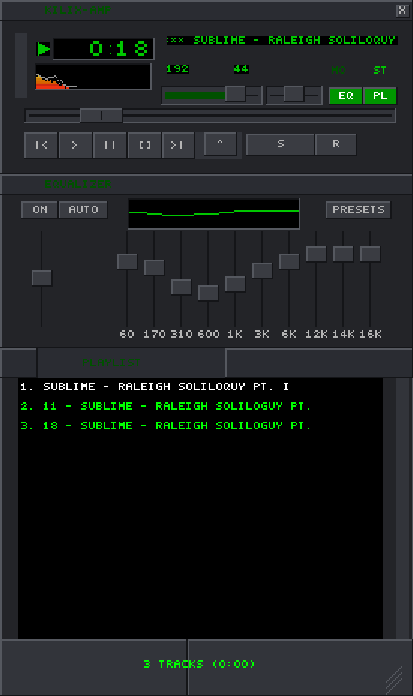

# kilix-amp - Winamp Clone for Linux, in C

A pixel-faithful recreation of the classic Winamp 2.x music player, written
in C11 with SDL2. This is a full rewrite of the Python/Qt "nixamp" project
with the same feature set and window-for-window architecture.



## Features

- **Classic Winamp 2.x UI** - Bitmap-based skin rendering with all the classic elements
- **4-window layout** - Main player, Equalizer, Playlist, and waveform Editor
- **Skin support** - Load .wsz skin files or skin directories (in-house ZIP reader)
- **10-band EQ** - In-house biquad filter chain with presets (Rock, Pop, Classical, ...)
- **Spectrum analyzer** - 75-bar display with peak dots, oscilloscope mode (in-house FFT)
- **Playlist** - M3U/PLS support, drag-and-drop, shuffle, repeat, sorting
- **Editor** - waveform view with 16 effects + 5 generators, selection, undo/redo
- **Window docking** - Snap windows together like the original
- **Keyboard shortcuts** - Z/X/C/V/B transport, all Winamp defaults
- **UI scaling** - integer 1x-4x scaling for HiDPI displays

## Dependencies

Runtime/build libraries (Debian package names):

```bash
sudo apt install build-essential libsdl2-dev libsdl2-image-dev \
    libsndfile1-dev zlib1g-dev
# optional, for native file-open dialogs:
sudo apt install zenity
```

Audio decoding goes through libsndfile: WAV, FLAC, Ogg/Vorbis, Opus, MP3
(libsndfile >= 1.1), AIFF and friends. Formats libsndfile cannot open
(m4a/aac/wma) are skipped with an error title, and the playlist auto-skips
to the next track.

## Building

```bash
make            # release build -> ./kilix-amp
make debug      # ASan/UBSan debug build
make test       # build + run the unit test suite
```

## Usage

```bash
./kilix-amp                          # empty player
./kilix-amp track1.mp3 track2.flac   # play files
./kilix-amp /path/to/music/          # play a directory
./kilix-amp --skin path/to/skin.wsz  # custom skin
./kilix-amp --scale 3                # UI scale 1-4 (--double-size = --scale 2)
```

The UI scale can also be changed at runtime from the right-click menu
(SIZE section) or by pressing `D` (cycles 1x-4x); it persists across runs.

On first start a default skin is generated at
`~/.local/share/kilix-amp/skins/default`. Settings are saved to
`~/.config/kilix-amp/kilix-amp.ini` (same INI layout as nixamp's config).

## Keyboard Shortcuts

| Key | Action |
|-----|--------|
| Z | Previous track |
| X | Play |
| C | Pause |
| V | Stop |
| B | Next track |
| L | Open file |
| Left/Right | Seek -/+5 seconds |
| Up/Down | Volume up/down |
| S | Toggle shuffle |
| R | Toggle repeat |
| D | Cycle UI scale (1x-4x) |
| Alt+G | Toggle equalizer |
| Alt+E | Toggle playlist |
| Alt+D | Toggle editor |
| Ctrl+Z/Y/A | Editor: undo / redo / select all |

## Architecture

| Module | Purpose |
|--------|---------|
| `src/audio.c` | playback engine: libsndfile decode -> preamp/EQ/volume/pan -> SDL queued audio |
| `src/dsp.c` | in-house radix-2 FFT + biquad peaking filters |
| `src/effects.c` | 21 editor effects/generators (scipy replaced in-house) |
| `src/audio_data.c` | editor buffer with selection + undo/redo |
| `src/zip.c` | minimal ZIP reader (stored + deflate via zlib) for .wsz |
| `src/skin.c` | skin loader: BMP/PNG sheets, viscolor.txt, pledit.txt |
| `src/skin_default.c` | procedural default-skin generator |
| `src/font4x6.c` | in-house 4x6 pixel font (also baked into text.bmp) |
| `src/render.c` | software-surface compositing + present at 1x/2x |
| `src/widgets.c` | bitmap button/toggle/slider primitives + hit dispatch |
| `src/spectrum.c` | 75-bar analyzer + oscilloscope |
| `src/win_main.c` | main 275x116 player window |
| `src/win_eq.c` | 10-band equalizer window |
| `src/win_playlist.c` | resizable playlist editor |
| `src/win_editor.c` | resizable waveform editor |
| `src/dock.c` | window snapping/docking |
| `src/menu.c` / `src/dialog.c` | in-house popup menus and modal param dialogs |
| `src/filedialog.c` | zenity-backed file dialogs (text-prompt fallback) |
| `src/playlist.c` | playlist model with M3U/PLS |
| `src/config.c` | INI settings persistence |
| `src/main.c` | component wiring, hotkeys, main loop |

## Differences from the Python original

- **No system tray** - the original used Qt's tray API; no lightweight
  C equivalent exists without a GTK/appindicator dependency.
- **Menus are flattened** - Qt cascading submenus become section headers
  in a single popup.
- **File dialogs use zenity** when installed, otherwise a text-entry path
  prompt.
- **Decoding is libsndfile-based** instead of GStreamer, so codec coverage
  differs slightly (no m4a/wma).
- **Pitch shift uses linear resampling** instead of scipy's FFT resampler;
  audibly equivalent for the +-12 semitone UI range.
- Everything else - window layout, skin coordinates, EQ curve math,
  playlist semantics, effect algorithms, config keys - is a direct port.

## Running Tests

```bash
make test
```

The suite (~5000 checks) covers the playlist model, M3U/PLS parsing, config
persistence, ZIP/skin loading including zip-bomb rejection, the default-skin
generator, FFT/biquad DSP, spectrum physics, all 21 effects/generators, the
editor buffer undo/redo model, and the widget primitives.
