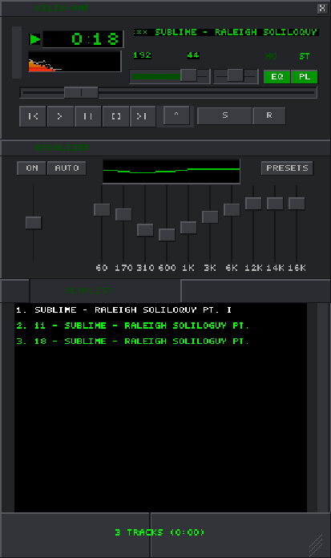

# kilix-amp - Winamp Clone for Linux, in C

A pixel-faithful recreation of the classic Winamp 2.x music player, written
in C11 with SDL2. This is a full rewrite of the Python/Qt "nixamp" project
with the same feature set and window-for-window architecture.



## Features

- **Classic Winamp 2.x UI** - Bitmap-based skin rendering with all the classic elements
- **4-window layout** - Main player, Equalizer, Playlist, and waveform Editor
- **Skin support** - Load .wsz skin files or skin directories (in-house ZIP reader)
- **10-band EQ** - In-house biquad filter chain with presets (Rock, Pop, Classical, ...)
- **Spectrum analyzer** - 75-bar display with peak dots, oscilloscope mode (in-house FFT)
- **Playlist** - M3U/PLS support, drag-and-drop, shuffle, repeat, sorting
- **Editor** - waveform view with 16 effects + 5 generators, selection, undo/redo
- **Window docking** - Snap windows together like the original
- **Keyboard shortcuts** - Z/X/C/V/B transport, all Winamp defaults
- **UI scaling** - integer 1x-4x scaling for HiDPI displays
- **Headless mode** - `--headless` serves a control socket, so a text front end
  drives the same decoder instead of reimplementing playback

## Dependencies

Runtime/build libraries (Debian package names):

```bash
sudo apt install build-essential libsdl2-dev libsdl2-image-dev \
    libsndfile1-dev zlib1g-dev libfluidsynth-dev fluidsynth \
    fluid-soundfont-gm
# optional, for native file-open dialogs:
sudo apt install zenity
```

Or run:

```bash
./install-deps.sh
```

Audio decoding goes through libsndfile for WAV, FLAC, Ogg/Vorbis, Opus, MP3
(libsndfile >= 1.1), AIFF and friends. MIDI files (`.mid`/`.midi`) are
rendered through FluidSynth using a GM SoundFont, then played through the same
SDL/EQ/volume pipeline as decoded audio. Set `KILIX_AMP_SOUNDFONT=/path/to.sf2`
to override the default SoundFont search.

Formats libsndfile cannot open (m4a/aac/wma) are skipped with an error title,
and the playlist auto-skips to the next track.

Local `.kenc` files can use the optional native `libkilix-encodec` decoder.
Build with `make ENCODEC=1` after installing its headers, shared library and
pkg-config metadata. Build that library with `ONNX=1 CONTENT=1` and the exact
`CONTENT_SOURCE` and `CONTENT_COMMIT` supplied by the application closure.
Its embedded catalog, admission helper and build receipt travel with the
library. `ENCODEC_CFLAGS` and `ENCODEC_LIBS` can select an explicit development
installation. The default build has no EnCodec runtime dependency
and reports an unavailable-model error for these files.

Normal file and live opens require the selected model to be installed and
admitted by the packaged Kilix content catalog (asset/v3) and a durable
kilix-license acceptance receipt. The installed tree must be exactly where
kilix-content's `Installer.asset_destination()` places it,
`<content root>/assets/<asset id>`, and match the catalog's manifest.
`KILIX_CONTENT_ROOT` selects the content storage root; otherwise Amp uses the
account's NSS home plus `.local/gpu_terminal/kilix/data/desktop-apps`. A host
that relocates Kilix storage must pass its resolved content root.
Receipts are only read, never written, from the directory
`kilix_license.receipt_store_root()` names: `$KILIX_LICENSE_RECEIPTS` if set,
otherwise `$GPU_TERMINAL_HOME/license-receipts`, otherwise
`$HOME/.local/gpu_terminal/license-receipts` (the NSS home when `HOME` is
unset). The admission helper receives exactly those three variables.
`XDG_STATE_HOME` does not select the receipt store, and receipts filed under
the earlier `$XDG_STATE_HOME/kilix-content/license-receipts/v1` layout are not
read; those models must be accepted again. A host that relocates receipt
storage must give Amp the same `KILIX_LICENSE_RECEIPTS` or `GPU_TERMINAL_HOME`
(and `HOME`) as the licence screen that filed the receipts. The store must be
the user's own directory with no group or other access.
`KILIX_ENCODEC_THREADS` accepts `1` or `2` (default).
Amp never installs or downloads a model. Missing receipts, undeclared assets,
or incompatible bytes produce an error. The helper verifies the full admitted
population, including its notices, then passes only the exact 9/4 native files
as sealed descriptors. Native compiled graph hashes and runtime checks still
apply. Admission repeats for every model load; graph-directory environment
variables do not authorize normal playback. Regular input audio files are
also copied into sealed private snapshots.

Both windowed and headless playback use one asynchronous source adapter and the
existing preamp/EQ/volume/pan/device path. An owned same-executable worker loads
models and decodes bounded records over a private socketpair; the UI performs
only nonblocking IPC and owned-child reaping. Pause keeps bounded prefetch;
stop or a source change kills only that worker. Workers inherit no application
FDs beyond their private channel, stderr and an explicitly selected live input,
and die if their parent exits.
Each has a 2 GiB address-space ceiling, 512 MiB file-size ceiling and 64 FD
ceiling. At most eight unreaped workers can exist during rapid source changes.

The 24 kHz mono profile supports 3/6/12 kb/s; 48 kHz stereo supports
3/6/12/24 kb/s. Seek starts at the verified preceding one-second mono epoch or
47520-sample stereo boundary; stereo pre-roll is handled by the shared decoder.
Old queued PCM is discarded and playback resumes after the worker acknowledges
the actual boundary. Loading and queue starvation are displayed as `loading`
and `buffering`. Stereo playback buffers at least 1.25 seconds before starting
(or the entire remainder for a shorter file), with a two-second device-queue
target. The selected thread count is reported through protocol 2; functional
playback does not by itself assert hardware or listening qualification.

For a live 24 kHz mono stream, use `--encodec-stdin` or
`--encodec-socket /absolute/private/source.sock`, without a file playlist.
Both windowed and headless modes accept the same framed input described in
[LIVE-FORMAT.md](LIVE-FORMAT.md). These are binary EnCodec inputs, not raw PCM,
local `.kenc` files or arbitrary network streams. Live playback shows elapsed
time and `LIVE`, has no finite duration or seek control, and reports recovery,
end and reconnect state. Stdin is single-use for the lifetime of the player.
A Unix source can be reopened explicitly after disconnect; playback never
reconnects or advances automatically. Live entries are omitted when saving a
file playlist.

For explicit native integration checks, build
`make ENCODEC=1 build-encodec/native_encodec`, then run
`python3 tests/run_encodec.py --test-binary build-encodec/native_encodec
--codec-command /path/to/kenc --mono-assets /path/to/mono
--stereo-assets /path/to/stereo --content-root /path/to/installed-content
--evidence-dir /path/to/new-evidence-directory`.
The receipt environment and embedded catalog must admit the selected profiles;
`--profile 24k` or `--profile 48k` narrows the run. Explicit
`--development-only` replaces `--content-root` for byte/path worker fixtures
and omits the installed shared-audio checks. It supplies no admission credit.
The test creates synthetic local WAVs at all seven profile/rate combinations,
checks exact worker/pre-DSP PCM against the shared decoder, and exercises seek,
pause, EOF, cancellation and unrelated-child preservation. `make ENCODEC=1 test`
also exercises malformed private worker replies using a separate test binary.
`tests/headless_encodec.py` checks the real player socket with explicit fixtures;
its dummy SDL output belongs only to that test process.
Build `make ENCODEC=1 build-encodec/native_live` and pass the mono asset
directory and a synthetic mono `.kenc` file with at least two seconds of audio
plus the content root to test live input, recovery and the shared audio path.
An explicit `--development-only` final argument instead omits the installed
shared-audio check. Run
`python3 tests/headless_live.py ./kilix-amp /path/to/mono.kenc
--evidence-dir /path/to/new-directory` for actual protocol-2 stdin and Unix
reconnect controls. `KILIX_CONTENT_ROOT` and the matching receipt environment
must select an admitted mono population for these actual-player checks.

`tests/headless_admission_stereo.py` exercises the actual player against an
installed asset/v3 content root and a kilix-license receipt store holding only
the 48 kHz receipt. `--content-source` must be the kilix-content checkout the
linked libkilix-encodec was built from; the install location and receipt name
come from its verified catalog. It checks normal playback, repeated admission
after receipt and file changes, wrong-receipt, notice and membership refusal,
and unadmitted mono file/live refusal despite valid legacy graph directories.
All mutations use private copies; the original installed population and
receipts must remain byte-identical. `--probe build-encodec/admission_probe.so`
records each admission result; with `--no-model-runtime` (a library built
without ONNX) an admitted case must show admission returning the sealed files
and the native loader then refusing, since both end in the same player error.

## Building

```bash
make            # release build -> ./kilix-amp
make debug      # ASan/UBSan debug build
make test       # build + run the unit test suite
```

## Usage

```bash
./kilix-amp                          # empty player
./kilix-amp track1.mp3 track2.flac   # play files
./kilix-amp /path/to/music/          # play a directory
./kilix-amp --skin path/to/skin.wsz  # custom skin
./kilix-amp --scale 3                # UI scale 1-4 (--double-size = --scale 2)
```

The UI scale can also be changed at runtime from the right-click menu
(SIZE section) or by pressing `D` (cycles 1x-4x); it persists across runs.

On first start a default skin is generated at
`${XDG_DATA_HOME:-~/.local/share}/kilix-amp/skins/default`. Settings are saved
to `${XDG_CONFIG_HOME:-~/.config}/kilix-amp/kilix-amp.ini` (the same INI
layout as nixamp's config). This lets desktop hosts give Kilix-Amp isolated,
persistent storage without changing `HOME`.

## Headless mode

`--headless` runs the player with no windows, no skin and no video subsystem —
only the decoder, the EQ chain and the playlist, driven over a Unix socket:

```bash
./kilix-amp --headless ~/Music/            # serve the default socket path
./kilix-amp --socket /tmp/amp.sock track.flac   # explicit path (implies --headless)
```

The point is that there is **one** playback implementation. A text front end
(`kilix-music` in kilix-tui-utils is the first) is a client of this socket
rather than a second decoder that drifts from this one.

The socket path is `$KILIX_AMP_SOCKET`, else `$XDG_RUNTIME_DIR/kilix-amp.sock`,
else `~/.local/gpu_terminal/kilix/session/kilix-amp.sock`. It is created
owner-only (0600). A second backend on a live socket is refused rather than
fighting the first one for the audio device. A stale socket left by a killed
run is also preserved and refused: after verifying that no Kilix Amp process is
running, remove that exact socket explicitly and restart. This fail-closed rule
avoids deleting a same-user replacement in a pathname race.

Headless mode **reads** the settings file and never writes it, so it cannot
overwrite the window layout or volume a windowed session is still using.

### Control protocol

One JSON object per line in, one per line out. Every reply carries `protocol`.
Version 1 retains the existing file-player contract. Version 2 adds explicit
source opens, live and model state, typed errors and exact wire timestamps.
Clients first send a read-only version-2 `ping`; they can fall back to a
version-1 `ping` when an older backend refuses. See
[CONTROL-PROTOCOL.md](CONTROL-PROTOCOL.md) for version negotiation, strict
framing and the complete version-2 fields.

```console
$ printf '{"cmd":"state","protocol":1}\n' | nc -U ~/.local/gpu_terminal/kilix/session/kilix-amp.sock
{"protocol":1,"ok":true,"state":"playing","title":"Public Domain - Ode to Joy","file":"/home/…/ode-to-joy.ogg","pos":12.678,"len":17.777,"index":0,"count":1,"volume":80,"shuffle":false,"repeat":0}
```

| Command | Fields | Effect |
|---|---|---|
| `ping` | | liveness; version 2 also reports capabilities |
| `state` | | current status (the reply shown above) |
| `playlist` | | `items` (paths), `index`, `count` |
| `play` | `index` (optional) | play that entry, else resume or start |
| `toggle` | | play/pause |
| `pause` / `stop` | | pause; stop and unload |
| `next` / `previous` | | honours shuffle and repeat |
| `seek` | `pos` (seconds) | absolute seek |
| `volume` | `level` (0-100) | set volume |
| `add` | `path` (file or directory) | append to the playlist |
| `clear` | | stop and empty the playlist |
| `shuffle` | `on` (optional bool) | set, or toggle when omitted |
| `repeat` | `mode` (optional 0/1/2) | set, or cycle when omitted |
| `quit` | | shut the backend down |
| `open` (v2) | `source_type`, `path` | replace with an explicit file or live Unix source |

Every mutating command answers with the state it produced, so a front end
redraws in one round trip. Failures reply `"ok":false` with an `error` string;
an unknown command is an error, never a silent no-op. `state` reports
`loading` between accepting a track and the decoder opening it — opening a file
is deferred to the next tick so a reply never waits on the decoder.

## Keyboard Shortcuts

| Key | Action |
|-----|--------|
| Z | Previous track |
| X | Play |
| C | Pause |
| V | Stop |
| B | Next track |
| L | Open file |
| Left/Right | Seek -/+5 seconds |
| Up/Down | Volume up/down |
| S | Toggle shuffle |
| R | Toggle repeat |
| D | Cycle UI scale (1x-4x) |
| Alt+G | Toggle equalizer |
| Alt+E | Toggle playlist |
| Alt+D | Toggle editor |
| Ctrl+Z/Y/A | Editor: undo / redo / select all |

## Architecture

| Module | Purpose |
|--------|---------|
| `src/audio.c` | playback engine: libsndfile decode or FluidSynth MIDI render -> preamp/EQ/volume/pan -> SDL queued audio |
| `src/headless.c` | `--headless`: the engine and playlist wired to the control socket, no windows |
| `src/control.c` | non-blocking AF_UNIX server; line framing, so a quiet client cannot stall decoding |
| `src/json.c` | bounded strict request validation, typed field readers and single-line writer |
| `src/dsp.c` | in-house radix-2 FFT + biquad peaking filters |
| `src/effects.c` | 21 editor effects/generators (scipy replaced in-house) |
| `src/audio_data.c` | editor buffer with selection + undo/redo |
| `src/zip.c` | minimal ZIP reader (stored + deflate via zlib) for .wsz |
| `src/skin.c` | skin loader: BMP/PNG sheets, viscolor.txt, pledit.txt |
| `src/skin_default.c` | procedural default-skin generator |
| `src/font4x6.c` | in-house 4x6 pixel font (also baked into text.bmp) |
| `src/render.c` | software-surface compositing + present at 1x/2x |
| `src/widgets.c` | bitmap button/toggle/slider primitives + hit dispatch |
| `src/spectrum.c` | 75-bar analyzer + oscilloscope |
| `src/win_main.c` | main 275x116 player window |
| `src/win_eq.c` | 10-band equalizer window |
| `src/win_playlist.c` | resizable playlist editor |
| `src/win_editor.c` | resizable waveform editor |
| `src/dock.c` | window snapping/docking |
| `src/menu.c` / `src/dialog.c` | in-house popup menus and modal param dialogs |
| `src/filedialog.c` | zenity-backed file dialogs (text-prompt fallback) |
| `src/playlist.c` | playlist model with M3U/PLS |
| `src/config.c` | INI settings persistence |
| `src/main.c` | component wiring, hotkeys, main loop |

## Differences from the Python original

- **No system tray** - the original used Qt's tray API; no lightweight
  C equivalent exists without a GTK/appindicator dependency.
- **Menus are flattened** - Qt cascading submenus become section headers
  in a single popup.
- **File dialogs use zenity** when installed, otherwise a text-entry path
  prompt.
- **Decoding is libsndfile-based** instead of GStreamer, with native
  FluidSynth rendering for MIDI, so codec coverage differs slightly
  (no m4a/wma).
- **Pitch shift uses linear resampling** instead of scipy's FFT resampler;
  audibly equivalent for the +-12 semitone UI range.
- Everything else - window layout, skin coordinates, EQ curve math,
  playlist semantics, effect algorithms, config keys - is a direct port.

## Running Tests

```bash
make test
```

The suite (~5000 checks) covers the playlist model, M3U/PLS parsing, config
persistence, ZIP/skin loading including zip-bomb rejection, the default-skin
generator, FFT/biquad DSP, spectrum physics, all 21 effects/generators, the
editor buffer undo/redo model, and the widget primitives.

## Licence and notices

Kilix Amp is licensed under the MIT License; see [`LICENSE`](LICENSE).
Vendored Termixer, the project screenshot, the generated CC0 sample and linked
system libraries are dispositioned in
[`THIRD-PARTY-NOTICES.md`](THIRD-PARTY-NOTICES.md).
